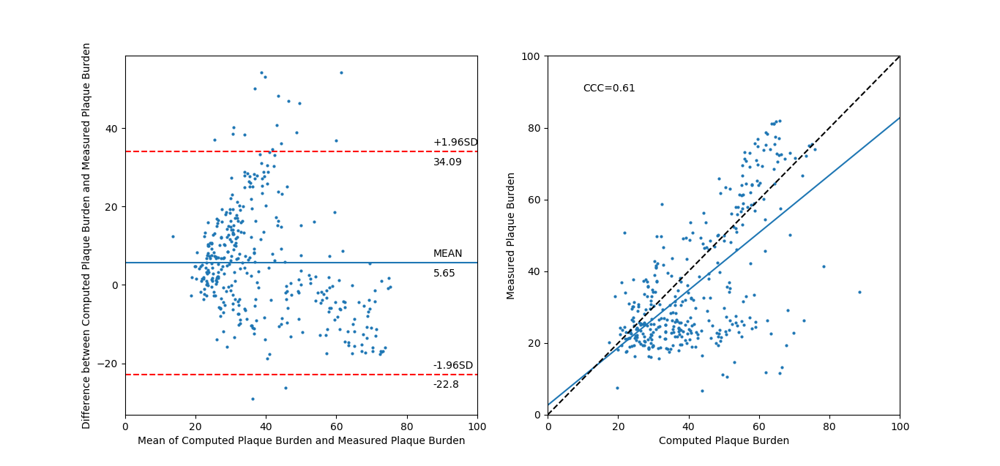

# Bland Altman and Concordance Correlation Coefficient
This code generates Bland-altman and concordance correlation coefficient for 2 input variables

## Input
The two variables should be saved as a csv file with two columns

## Usage
From the command window run the file with the path to the csv file provided
```python
patient_name = python bland_altman.py --fname=path\to\csv\file.csv
```
Optionally the variables data labels can be specified with the arguments var1 and var2
```
python bland_altman.py --fname=path\to\csv\file.csv --var1="Computed Plaque Burden" --var2="Measured Plaque Burden"
```

## Output
The code returns the bland-altman plot and the concordance correlatoin plot and coefficient

